# PolyTest AI 🚀
### *Universal Multi-Language AI Static Code Analyzer & Unit Test Generator*

**PolyTest AI** is a modular, high-speed, and intelligent test suite generator that analyzes source code across multiple programming languages and automatically outputs comprehensive, framework-specific unit test suites using Large Language Models.

Unlike simple single-language code templates, PolyTest AI parses raw source files, extracts class/method structural signatures, resolves complexity heuristics, queries a suite of SDK-free LLM API providers, and compiles output files through a **Multi-Language Syntax Validator** to guarantee 100% runnable, error-free tests before writing them to disk.

---

## 🎨 Architectural Design

```mermaid
graph TD
    CLI[cli/main.py] --> Config[core/config/config_manager.py]
    CLI --> Generator[core/generator/test_generator.py]
    
    Generator --> Detector[core/analyzer/detector.py]
    Generator --> Factory[core/analyzer/parser_factory.py]
    
    Factory --> PyParser[core/analyzer/parsers/python_parser.py]
    Factory --> JSParser[core/analyzer/parsers/javascript_parser.py]
    Factory --> CppParser[core/analyzer/parsers/cpp_parser.py]
    Factory --> JavaParser[core/analyzer/parsers/java_parser.py]
    Factory --> GoParser[core/analyzer/parsers/go_parser.py]
    Factory --> CSharpParser[core/analyzer/parsers/csharp_parser.py]
    
    Generator --> Context[core/context/context_builder.py]
    Generator --> Prompt[core/llm/prompt_builder.py]
    
    Generator --> LLM[core/llm/llm_client.py]
    LLM --> MockProvider[core/llm/providers/mock_provider.py]
    LLM --> OpenAI[core/llm/providers/openai_provider.py]
    LLM --> Gemini[core/llm/providers/gemini_provider.py]
    LLM --> Anthropic[core/llm/providers/anthropic_provider.py]
    LLM --> Ollama[core/llm/providers/ollama_provider.py]
    
    Generator --> Validator[core/validator/syntax_validator.py]
    Validator --> Output[tests/ generated test files]
```



---

## ✨ Core Features

*   🌍 **7-Language Analyzer Engine**: Out-of-the-box structural code parser support for **Python, JavaScript, TypeScript, C++, Java, Go, and C#**.
*   ⚡ **SDK-Free LLM Clients**: Connects directly to **OpenAI, Google Gemini, Anthropic Claude, and local Ollama servers** via HTTP `requests`, keeping the codebase secure from package dependency deprecations.
*   🛡️ **Multi-Language Syntax Validator**: Leverages local compilers and syntax linters (`javac`, `go tool compile`, `g++ -fsyntax-only`, `node --check`, `csc`) to verify test suite correctness before saving.
*   💾 **Environment-Resilient Warnings**: Automatically detects missing host-specific libraries (e.g. `gtest/gtest.h` or `mockito` packages) and logs them as helpful warnings rather than throwing hard compiler compilation failures.
*   📦 **Smart Local Caching**: Saves generated test suites under `cache/*.log` to bypass duplicate LLM API charges for unchanged code.
*   🔄 **Directory Batching**: Automated directory walking to scan, parse, generate, and validate tests recursively across entire folders.
*   💎 **Premium Terminal Interface**: Beautiful command parser powered by the `rich` library with custom panels, progress spinners, colorized syntax tables, and detailed logs.

---

## 📂 Directory Layout

*   `core/analyzer/`: Dynamic static analysers that extract namespaces, class layouts, dependencies, parameters, and complexity scores.
*   `core/context/`: Context aggregators that prepare code metadata for the LLM prompt.
*   `core/llm/`: Unified clients routing prompts to API providers and parsing markdown code envelopes.
*   `core/validator/`: Non-destructive compiler checks that run syntax and code safety verification.
*   `core/config/`: Local YAML configuration manager (`polytest.yaml`).
*   `cli/`: CLI dashboard commands (`init`, `detect`, `analyze`, `generate`).
*   `src/`: Example multi-language codebase (`calculator.py`, `user_service.js`, `auth.h`).
*   `tests/`: Generated test output suites.

---

## 🚀 Getting Started

### 1. Installation & Environment Activation
Set up your local directory and activate the virtual environment:
```bash
git clone https://github.com/yadavxprakhar/PolyTest-AI.git
cd PolyTest-AI
source .venv/bin/activate
pip install -r requirements.txt
```

### 2. Initialize Configuration
Generates a local `polytest.yaml` settings schema:
```bash
python3 -m cli.main init
```

### 3. Scan & Auto-Detect Source Files
Recursively search folders, locate source code files, and auto-configure testing frameworks:
```bash
python3 -m cli.main detect
```

### 4. Deep Structural Analysis
Perform local static structural parsing to review class declarations and method signatures:
```bash
python3 -m cli.main analyze src/calculator.py
python3 -m cli.main analyze src/user_service.js
```

### 5. Generate Unit Tests Offline (Dry-Run Mode)
Instantly generate, compile, and validate test suites using PolyTest AI's high-speed offline Mock engine:
```bash
python3 -m cli.main generate src/ --mock --no-cache
```

### 6. Live AI API Generation (OpenAI / Gemini / Anthropic / Ollama)
Enter your API credentials in `polytest.yaml` or export them to your shell (e.g. `export GEMINI_API_KEY="..."`), then run:
```bash
python3 -m cli.main generate src/calculator.py --provider gemini --model gemini-1.5-flash
```

---

## 🧪 Supported Test Frameworks

| Language | Default Framework | Supported Frameworks | Validator Tool |
| :--- | :---: | :---: | :--- |
| **Python** | `pytest` | `pytest`, `unittest` | Native Python AST (`compile`) |
| **JavaScript** | `Jest` | `Jest`, `Mocha` | Node linter (`node --check`) |
| **TypeScript** | `Jest` | `Jest`, `Mocha` | Node linter (`node --check`) |
| **Java** | `JUnit 5` | `JUnit 5`, `JUnit 4` | Java Compiler (`javac`) |
| **C++** | `Google Test` | `Google Test` | C++ Compiler (`g++` / `clang++`) |
| **Go** | `testing` | `testing` | Go toolchain (`go tool compile`) |
| **C#** | `xUnit` | `xUnit` | Mono / Roslyn Compiler (`csc`) |

---

## 🤝 Contributing

1. Fork the repository.
2. Create a feature branch: `git checkout -b feature/amazing-feature`.
3. Commit your changes: `git commit -m "feat: Add amazing feature"`.
4. Push to the branch: `git push origin feature/amazing-feature`.
5. Open a Pull Request.

---

## 📜 License

Distributed under the MIT License. See [LICENSE](LICENSE) for more details.
